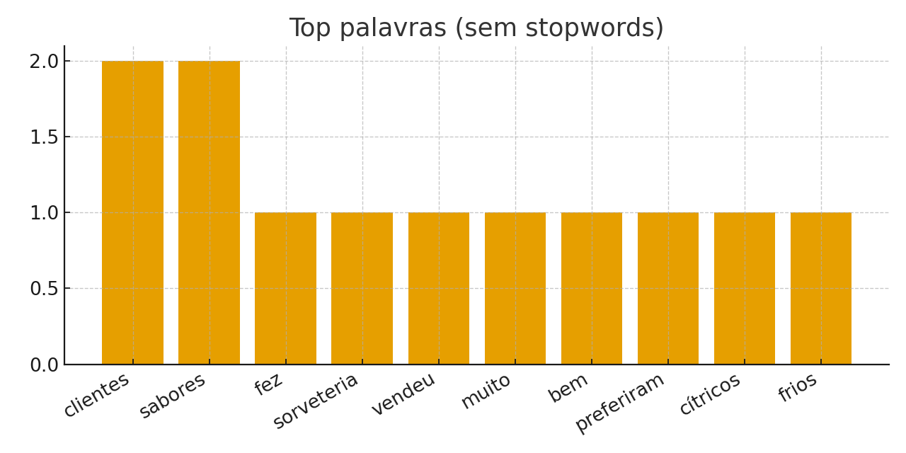

# Relatório de Análise de Sentenças

- Total de sentenças: **6**
- Total de tokens (limpos): **40**
## Top 10 palavras

| palavra    |   frequencia |
|:-----------|-------------:|
| clientes   |            2 |
| sabores    |            2 |
| fez        |            1 |
| sorveteria |            1 |
| vendeu     |            1 |
| muito      |            1 |
| bem        |            1 |
| preferiram |            1 |
| cítricos   |            1 |
| frios      |            1 |

## Observações rápidas

- Clima influencia a demanda de sorvete (quente ↑, frio/chuva ↓).
- Finais de semana têm mais movimento que dias úteis.
- Instagram e promoções ajudam a atrair clientes.
